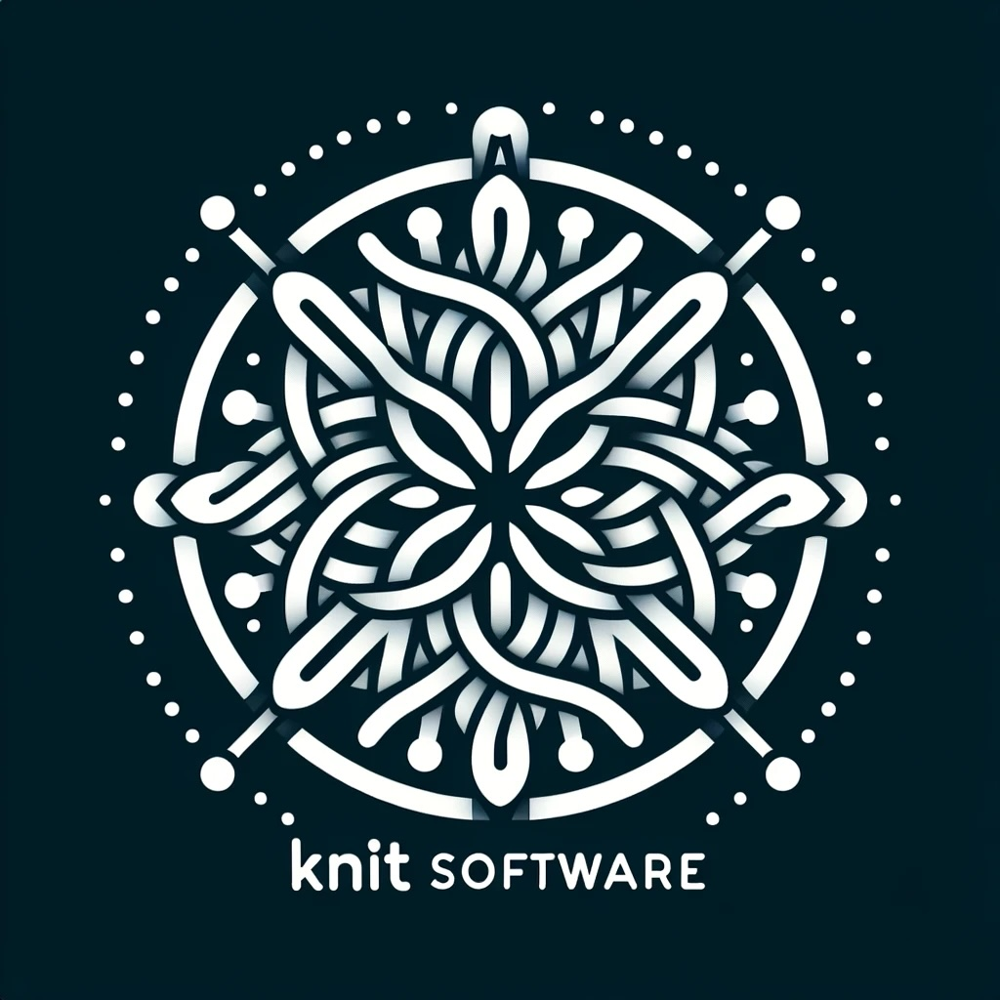

# Destekçiler

## Nasıl Destek Olabilirsin?

FizyoPaylaş’a destek olmanın en değerli yolu, her hafta toplantılara katılıp nazik, destekleyici ve saygılı bir katılımcı olmandır. İkinci en etkili destek ise bu topluluğu çevrendeki diğer fizyoterapistlere tavsiye etmendir.

### Gönüllü Ol

Etkinliklerin organizasyonu, sosyal medya, web sitesi düzenlemeleri gibi konularda gönüllü desteğe de ihtiyacımız var. Eğer sen de katkı sunmak istersen, lütfen [pt.abdullahagar@gmail.com](mailto:pt.abdullahagar@gmail.com) adresinden benimle iletişime geç.

### Sponsor Ol

FizyoPaylaş’ın sürdürülebilirliği için teknik ve maddi destek büyük önem taşıyor. Alan adı, web hosting, video platformları ve diğer altyapılar gönüllü desteklerle yürütülmektedir.

Eğer siz de bireysel ya da kurumsal sponsor olarak bu projeye destek olmak isterseniz, bizimle iletişime geçebilirsiniz.

---

## Şu Ana Kadarki Destekçilerimiz

### 🧶 Knit Software

  
  

    Web sitemizin barınması (hosting), Google Meet altyapısı ve teknik destek konusunda katkı sağladıkları için <strong>Knit Software</strong>’e teşekkür ederiz.
  

Web sitesi: <a href="https://www.knitsoftware.com" target="_blank">https://www.knitsoftware.com</a>

